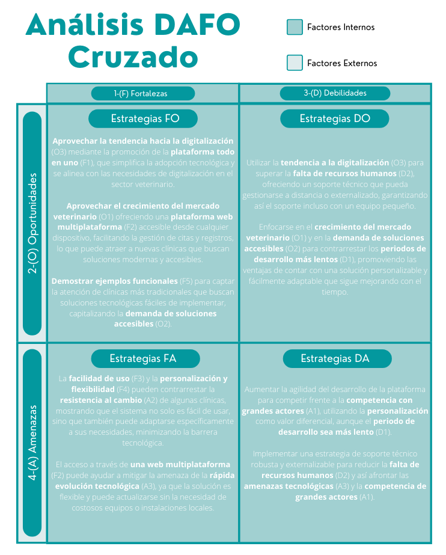

# Anteproxecto fin de ciclo

- [Anteproxecto fin de ciclo](#anteproxecto-fin-de-ciclo)
  - [1- Descrición do proxecto](#1--descrición-do-proxecto)
  - [2- Empresa](#2--empresa)
    - [2.1- Idea de negocio](#21--idea-de-negocio)
    - [2.2- Xustificación da idea](#22--xustificación-da-idea)
    - [2.3- Segmento de clientes](#23--segmento-de-clientes)
    - [2.4- Competencia](#24--competencia)
    - [2.5- Proposta de valor](#25--proposta-de-valor)
    - [2.6- Forma xurídica](#26--forma-xurídica)
    - [2.7- Investimentos](#27--investimentos)
      - [2.7.1- Custos](#271--custos)
      - [2.7.2- Ingresos](#272--ingresos)
    - [2.8- Viabilidade](#28--viabilidade)
      - [2.8.1- Viabilidade técnica](#281--viabilidade-técnica)
      - [2.8.2 - Viabilidade económica](#282---viabilidade-económica)
      - [2.8.3- Conclusión](#283--conclusión)
  - [3- Requirimentos técnicos](#3--requirimentos-técnicos)
  - [4- Planificación](#4--planificación)

> _EXPLICACIÓN_: Este documento será a páxina de explicación de en que consiste o teu proxecto. Coida a súa redacción con todo ou teu mimo. Elimina posteriormente todas as lineas "EXPLICACIÓN" cando creas finalizada a súa redacción.
> Podes acompañar á redacción deste ficheiro con imaxes, pero non abuses deles.
> Explica da mellor forma posible de en que consiste o proxecto é que ferramentas e linguaxes de programación empregarás.

## 1- Descrición do proxecto

> _EXPLICACIÓN_: Realiza unha breve descrición do anteproxecto.Resalta o fundamental *coas túas propias palabras\*\*. Utiliza unha linguaxe correcta, *pero natural\*\*, que o entenda todo o mundo, mesmo e en especial, as persoas que non teñan un coñecemento técnico avanzado. Pode ser un estracto ou resumo de apartados que xa contemples noutros ficheiros.
>
> Neste apartado trátase de describir a análise realizada e a toma de decisións adoptada sobre aspectos básicos ou iniciais do proxecto como:
>
> - ¿En que consiste o noso proxecto? ¿Cal é o propósito principal da aplicación a desenvolver? ¿Cales son os obxectivos?
> - ¿O desenvolvemento da aplicación abre unha oportunidade de negocio? ¿É posible comercializala? Como?
> - ¿Que tecnoloxías son as máis axeitadas para a realización do proxecto?

Mi proyecto consiste en un **software para clínicas veterinarias**, cuyo propósito es acercar la clínica a sus pacientes y facilitarle la vida tanto a los clientes como a los propios veterinarios y veterinarias.

El proyecto **no es solo una web para clínicas veterinarias, sino una plataforma integral** que combina la gestión interna de la clínica (citas, historiales médicos, etc.) con una herramienta de captación y comunicación externa. Esto significa que la clínica puede gestionar todo en una única plataforma, tanto para su funcionamiento interno como para su imagen hacia los clientes.

Dicho software consistirá en dos partes:

1. Una parte para el cliente cuyo objetivo es tener un primer vistazo atractivo, que te haga elegirlos frente a otras clínicas, y que después decidas quedarte por la facilidad para pedir, modificar y anular tus citas, y gestionar la información clínica de tus mascotas.

2. Una parte para el profesional veterinario cuyo objetivo es poder organizar su día con facilidad teniendo todas sus citas en un mismo lugar, y pudiendo consultar y ampliar rápidamente el historial clínico de su paciente para dar el mejor servicio a su cliente.

La web será totalmente personalizable para cada clínica que la compre, consiguiendo que con la base de la misma web cada clínica tenga su propia página totalmente diferenciada de los demás. Podrán personalizar desde los colores y el logotipo hasta funciones específicas según sus necesidades.

**Tecnologías**:
Para el front-end usaría Angular, HTML y CSS. Para el back-end crearía una API sencilla con Slim (PHP y SQL). Y para la implementación contrataría un hosting externo y un dominio.

## 2- Empresa

> _EXPLICACIÓN_: Neste apartado desenvolveredes todo o referente os módulos de Empresa e iniciativa emprendedora e de FOL.

### 2.1- Idea de negocio

> _EXPLICACIÓN_: Define o producto central, o valor engadido e a utilidade. Se se ogrecen productos aumentados, indicalo tamén.

- **Producto central**: una solución web integral que permite tanto la gestión interna de la clínica como la captación de clientes a través de su imagen online.
- **Valor añadido**: actualizaciones periódicas y soporte técnico, asegurando que las clínicas siempre cuenten con las últimas mejoras y puedan resolver cualquier incidencia rápidamente.
- **Utilidad**: la comodidad para la gestión de la clínica y el ahorro y facilidad que les supone tener dos servicios contratando solo uno. Por ejemplo, las clínicas podrán gestionar sus citas y actualizar historiales médicos sin necesidad de usar múltiples herramientas, lo que reducirá el tiempo administrativo y permitirá dedicar más atención a sus pacientes.

### 2.2- Xustificación da idea

> _EXPLICACIÓN_: Neste apartado incluirase a información necesaria para xustificar a realización do proxecto. Debe indicarse como xurdiu a idea do proxecto, que obxectivo se persegue coa súa posta en marcha e/ou que problema vai resolver.
>
> En este apartado indicade a nivel de idea de negocio:
>
> - ¿Cal é a necesidade ou necesidades que se pretenden cubrir ou satisfacer?
> - ¿Existen na actualidade aplicacións ou productos que tenten dar resposta a esa(s) necesidade(s)? ¿En que medida o conseguen?
> - ¿Trátase de un segmento de mercado desabastecido ou insuficientemente atendido?
> - ¿Un produto ineficiente? Un mercado novo?
>
> Para sustentar as xustificación deberás proporcionar datos. Fontes máis utilizadas: INE, IGE, Informes sectoriais de Industria, Statista... Deberás facer unha DAFO.

La idea de este proyecto nace de una necesidad propia. Tengo una gata y una perra con diferentes problemas y necesidades médicas. Por ejemplo mi perra tiene una dieta de comida cocinada cuyas proporciones me encantaría tener a mano a unos pocos clics de distancia si alguna vez tengo alguna duda de las cantidades.
También me resultaría mucho más cómodo a la hora de pedir una cita poder ver un calendario de fechas disponibles y sus horas, en vez de tener que perder mi tiempo y el de la persona al otro lado con una conversación de whatsapp o una llamada telefónica. Lo mismo a la hora de modificar o cancelar dicha cita si surge algún imprevisto.

Como veterinario o veterinaria, si buscas empezar tu negocio, o introducirlo al mundo de internet, lo que se te ofrece es tener que crear tu web cara al público y tu software de gestión por separado, lo cual es engorroso.

En el mercado hay una amplia oferta de softwares de gestión de citas y pacientes, algunos incluso con consulta del historial médico, pero todos son programas que tanto el cliente como el veterinario o veterinaria deben instalar, una desventaja frente a un fácil acceso vía web. Esto elimina los problemas que puedan surgir en el proceso de instalación y configuración.

Tener todo a tu alcance en la misma web también es una ventaja respecto al software de la competencia ya que se puede atraer al cliente con una página de inicio atractiva y cuando quiera contratar los servicios de la clínica solo tendrá que hacer unos pocos clics, un formulario, un calendario y ya tendrá la cita solicitada sin tener que esperar respuestas a formularios o mensajes de whatsapp.

Una última desventaja de dichos softwares es que no puedes ver un ejemplo de él fácilmente.

Las clínicas veterinarias son un segmento de mercado insuficientemente atendido, ya que la oferta en el mencado va dirigida a grandes clínicas y no a la pequeña y mediana clínica que no necesita la mitad de las cosas que se le ofrecen, no tiene el material necesario (ordenadores que soporten esos softwares), ni tampoco la economía ni el tiempo para aprender a instalar y manejar el gestor, lo cual convierte a dichos softwares en productos ineficientes que esas clínicas ni se plantean contratar.

**DAFO**:

- **Debilidades**:

  - **Periodos de desarrollo más lentos** que los de empresas más grandes, lo que puede hacer que el producto tarde más en estar completamente optimizado o disponible para nuevos clientes.
  - **Falta de recursos humanos**: al ser un proyecto pequeño o individual, puede haber limitaciones en cuanto al soporte o la capacidad de respuesta rápida ante incidencias técnicas.

- **Amenazas**:

  - **Competencia con grandes actores**: empresas como IDEXX y VetZ dominan el mercado, lo que puede dificultar la entrada y el posicionamiento de nuevas soluciones en el mercado global.
  - **Resistencia al cambio**: algunas clínicas, especialmente las más pequeñas, pueden ser reacias a adoptar nuevas tecnologías por temor a complejidad, costes ocultos o la falta de conocimientos tecnológicos.
  - **Rápida evolución tecnológica**: el software de gestión clínica está en constante evolución, lo que puede hacer que las soluciones queden obsoletas rápidamente si no se actualizan con frecuencia.

- **Fortalezas**:

  - **Plataforma todo en uno**: la integración de la gestión interna con la captación de clientes en una sola plataforma es un punto diferenciador frente a la competencia, que solo ofrece soluciones parciales.
  - **Acceso web multiplataforma**: permite a clientes y veterinarios acceder a la gestión de citas y a los historiales médicos desde cualquier dispositivo con conexión a internet, sin necesidad de instalaciones locales.
  - **Facilidad de uso**: la posibilidad de ver un calendario de citas y gestionar todo desde una sola web hace el proceso más eficiente y cómodo para los usuarios.
  - **Personalización y flexibilidad**: cada clínica puede adaptar el software a sus necesidades específicas, lo que da un valor añadido a la solución frente a otras opciones más rígidas.
  - **Ejemplos funcionales disponibles**: se puede mostrar un ejemplo funcional del software a potenciales clientes, lo que facilita la toma de decisiones.

- **Oportunidades**:

  - **Crecimiento del mercado veterinario**: el número de clínicas veterinarias está en aumento, y con él la necesidad de soluciones tecnológicas que mejoren la eficiencia y reduzcan los costos administrativos.

  - **Demanda de Soluciones Accesibles**: existe una demanda creciente de soluciones accesibles y fáciles de usar que no requieran instalaciones complicadas ni equipos especializados. [animalshealth](https://www.animalshealth.es/empresas/barreras-entrada-algunos-centros-veterinarios-resisten-adoptar-nuevas-tecnologias#:~:text=Los%20principales%20factores,ser%20prohibitivos%E2%80%9D%2C%20se%C3%B1alan.)
  - **Tendencia a la digitalización**: la transformación digital en el sector veterinario es cada vez más importante, y muchas clínicas buscan software que les permita reducir el papeleo y mejorar la eficiencia operativa.

  

### 2.3- Segmento de clientes

> _EXPLICACIÓN_: Neste apartado debes indicar a quen irá dirixido o negocio, os potenciales clientes, respostando as seguinte pregunta: ¿A quen está dirixido?
>
> Debes:
>
> - Indicar o segmento ou segmentos cos rasgos principais e cuantificar o mercado.
> - E se é o caso, diferenciar entre usuario e cliente.

#### **Segmentos Principales del Mercado**

El segmento principal serán **clínicas veterinarias pequeñas y medianas en la región de Galicia**.

La estrategia inicial se centrará en el mercado local, donde se planificará una combinación de tácticas para atraer a los primeros clientes. Para ello:

- **Demostraciones presenciales y online**: se ofrecerán sesiones de demostración personalizadas, donde los veterinarios podrán experimentar la plataforma y ver su utilidad en acción.
- **Campañas de marketing digital**: se implementará una estrategia en redes sociales y Google Ads dirigida específicamente a la audiencia de Galicia, destacando los beneficios del software y compartiendo testimonios de clínicas que ya lo utilizan.
- **Networking y relaciones personales**: se buscará establecer conexiones con veterinarios a través de eventos locales, ferias y conferencias, facilitando un espacio para que puedan conocer el producto de forma más directa.

#### **Diferenciación entre Usuario y Cliente**

- **Cliente**: en este caso, el cliente es la clínica veterinaria que compra el servicio web. Son los que tomarán la decisión de adquirir y pagar por el producto.
- **Usuario**: los usuarios finales serán los veterinarios, el personal de la clínica y los clientes de la clínica que interactuarán con la plataforma para gestionar citas y acceder a la información médica.

### 2.4- Competencia

> _EXPLICACIÓN_: Neste apartado deberase indicar que outras empresas operan no mercado. Que cota de mercado teñen e como están posicionadas. Existencia de productos/servizos substitutivos. Como están posicionados.

**Empresas que operan en el mercado:**
El mercado de software veterinario es moderadamente competitivo, con varias empresas bien establecidas y algunas emergentes que compiten por la cuota de mercado.

- **Carestream Health**: se posiciona como un líder en la industria del software veterinario, ofreciendo soluciones avanzadas en imagenología médica, tanto para la atención veterinaria como para el cuidado de la salud humana. Su software está enfocado principalmente en la gestión y análisis de imágenes médicas, lo que lo hace particularmente popular en clínicas y hospitales veterinarios que requieren capacidades avanzadas en diagnóstico por imágenes. La compañía ha conseguido una importante cuota de mercado debido a su enfoque en tecnologías de alta precisión y su integración con otros sistemas de gestión veterinaria.

- **IDEXX Laboratories, Inc.**: es uno de los líderes del mercado global de software veterinario, ofreciendo soluciones integradas que abarcan desde software de gestión de clínicas hasta herramientas de diagnóstico. Su fuerte presencia y reputación en el mercado veterinario le otorgan una cuota significativa de mercado.

- **Patterson Companies, Inc.**: se especializa en soluciones de software veterinario y hardware complementario, posicionándose bien dentro del mercado.

- **Animal Intelligence Software, Inc.**: es conocida por sus soluciones personalizables para grandes hospitales y clínicas especializadas. A pesar de ser menos conocida que IDEXX o Covetrus, ha ganado una cuota importante debido a su enfoque en la personalización y su habilidad para ofrecer software adaptado a las necesidades específicas de sus clientes.

- **Covetrus, Inc.**: ha emergido como un actor clave en la gestión veterinaria, ofreciendo software basado en la nube que facilita la administración de clínicas veterinarias. Su enfoque en soluciones tecnológicas de última generación, combinadas con su fuerte presencia en América del Norte y Europa, le asegura una importante participación en el mercado.

Aunque la competencia en el mercado del software veterinario es fuerte, mi producto ofrece una **solución más accesible** y específica para **clínicas pequeñas y medianas** que no necesitan todas las funcionalidades de los grandes softwares, pero sí un sistema ágil y fácil de usar.

**Productos y servicios sustitutos:**
Existen productos sustitutos en el mercado, como software de gestión general adaptable a clínicas veterinarias o incluso soluciones de código abierto. Sin embargo, estos productos no están diseñados específicamente para la gestión veterinaria, lo que hace que las soluciones dedicadas, como las ofrecidas por las empresas mencionadas, sean preferidas por la mayoría de las clínicas.

### 2.5- Proposta de valor

> _EXPLICACIÓN_: **Apartado fundamental.**
>
> - En que se diferencia fronte os competidores.
> - Que melloras terá fronte os competidores.
> - Que valor aporta ao mercado.
> - ¿Porqué mercarán/contratarán este producto/servizo/idea fronte o resto?

- **Diferencia frente a los competidores**:

  - Enfoque en clínicas pequeñas y medianas
  - Accesibilidad y facilidad de uso
  - Diseño atractivo y funcionalidad integrada (gestión de citas e historial médico)

- **Mejoras frente a los competidores**:

  - Integración todo en uno (web + gestor)
  - Adaptación a presupuestos ajustados
  - Fácil personalización

- **Valor que aporta al mercado**:

  - Facilita la gestión eficiente
  - Mejora la experiencia del cliente
  - Simplifica los procesos

- **Razones para elegir este producto**:
  - Simplicidad y eficiencia
  - Acceso inmediato y sin barreras técnicas
  - Coste asequible

### 2.6- Forma xurídica

> _EXPLICACIÓN_: Neste apartado deberedes indicar a forma xurídica: autónomo, soc. Cooperativa, SL,.. Explicando (nun par de frases) por que escolledes esta forma

He optado por emprender como **autónoma** para el proyecto de software para clínicas veterinarias por las siguientes razones:

- **Simplicidad en la constitución**

- **Costes reducidos**: operar como autónoma implica menores costes iniciales y de mantenimiento. Se especifica mejor en el aparatado [2.6- Forma xurídica](#26--forma-xurídica).

- **Control total sobre la gestión**: como autónoma, tengo un control completo sobre la toma de decisiones y la dirección del negocio, lo que facilita la flexibilidad y rapidez en la adaptación a cambios del mercado o necesidades de los clientes.

- **Beneficios fiscales iniciales**: Se especifica mejor en el aparatado [2.7.1- Custos](#271--custos).

- **Menos formalidades legales**

- **Oportunidad de escalar a SL en el futuro**: si el proyecto crece y se estabiliza, tengo la opción de transformar la estructura en una Sociedad Limitada más adelante, lo que ofrece flexibilidad en la evolución del negocio.

### 2.7- Investimentos

> _EXPLICACIÓN_: Neste apartado idicaremos o investimentos, aínda que sexa, só unha enumeración de todo o que necesitan (locais, infraestruturas, equipos, suministros, mobiliario...) cuantificando cada elemento.

#### 2.7.1- Custos

> > _EXPLICACIÓN_: Neste apartado idicaremos o invertimento
>
> - Diferenzando custos fixos de variables.
> - Computando impostos e custos sociais.

- **Costes fijos**:

  - Equipos electrónicos:

    - Ordenador: 688'98€ [pccomponentes](https://www.pccomponentes.com/pc-racing-amd-ryzen-5-5600x-16gb-1tb-ssd-gtx-1650)
    - Monitores: 81'99x2 = 163,98€ [pccomponentes](https://www.pccomponentes.com/alurin-corevision-100ipslite-238-fhd-100hz-freesync)
    - Teclado: 20'99€ [pccomponentes](https://www.pccomponentes.com/tempest-k11-ogre-teclado-mecanico-gaming-rgb-negro)
    - Ratón: 13'99€ [pccomponentes](https://www.pccomponentes.com/tempest-x8-keeper-rgb-raton-gaming-10000-dpi-negro)
    - Impresora: 94'99€ [pccomponentes](https://www.pccomponentes.com/brother-hl-l2445dw-impresora-laser-monocromo-wifi-duplex?refurbished)

  - Conexión a internet: 35€/mes [Vodafone](https://oferta.vodafone.es/empresas/vodafone-one/?cid=187410880:dt-20140601:cp-vdf_toe_continuidad:cn-sem:kw-303347455189:cl-no_cliente:sp-Google:cr-:gk-marca:st-prospecting:ta-base:md-empresas:ds-responsive:pr-one:wn-toe:pl-/VDF-TOE-PureBrand-Def-BASE&gad_source=1&gclid=Cj0KCQjwrp-3BhDgARIsAEWJ6SzRmeV6WUeBEDHSEE574VMvzBWwF_NcX9ZGhkNOA0xXin03-xTFNUQaAnw2EALw_wcB)

  - Electricidad, agua y calefacción = 60€/mes aproximadamente

  - Mobiliario:

    - Silla: 109€ [Bricocentro Arousa](https://www.bricocentroarousa.es/producto/sillon-duke-simil-piel-blanco-atb-8000556)
    - Escritorio: 114'95€ [Bricocentro Arousa](https://www.bricocentroarousa.es/producto/escritorio-reversible-blanco-artik-75x138x50cm-ds-fores-82813)
    - Soportes ergonómicos ratón y teclado: 8,45€ [Shein](https://es.shein.com/2-In-1-Cloud-Shaped-Keyboard-And-Mouse-Wrist-Rest-Pad-Silicone-Skin-Hand-Support-High-Density-Memory-Foam-For-Ergonomic-Wrist-Support-For-Office-Computer-Laptop-Gaming-Mouse-Pad-White-p-31630192.html?src_identifier=st%3D2%60sc%3Dnube%20teclado%60sr%3D0%60ps%3D1&src_module=search&src_tab_page_id=page_home1726504418616&mallCode=1&pageListType=4&imgRatio=1-1)

  - Salario: 1500€/mes

- **Costes variables**:

  - Material de oficina (papelería, tinta, etc.): 30€/mes aproximadamente
  - Software y herramientas:
    - Hosting (incluye dominio y base de datos): 36€/año el primer año [Arsys](https://www.arsys.es/hosting)
  - Marketing digital: 300€/mes

- **Impuestos**:

  - Cuota seguridad social: como trabajadora autónoma menor de 30 años, puedo beneficiarme de la **Tarifa Plana** durante los primeros 12 meses, con una reducción en la cuota, lo que significa pagar 80€ mensuales durante ese periodo. ([autonomosyemprendedor](https://www.autonomosyemprendedor.es/articulo/tu-negocio/que-beneficios-pueden-optar-jovenes-menores-30-anos-que-desean-ser-autonomos-2023/20230711155644031307.html#:~:text=Los%20j%C3%B3venes%20que%20se,Interprofesional%20en%C2%A0dicho%20periodo.)) Además, la Xunta ofrece la **Cupta Cero** para autónomos nuevos, cubriendo la totalidad de la cuota mínima durante un año, lo que reduce el coste mensual a 0€ en los primeros 12 meses. ([oficinadoautonomo.gal](https://oficinadoautonomo.gal/es/blog/5549#:~:text=El%20Diario%20Oficial%20de%20Galicia%20publica,los%2012%20primeros%20meses%20de%20actividad.))

  - IVA y otros impuestos: se deben hacer declaraciones trimestrales del IVA (21%) en función de las ventas realizadas, así como la Declaración de la Renta (IRPF), donde se tributará dependiendo de los beneficios anuales.

#### 2.7.2- Ingresos

> _EXPLICACIÓN_: Neste apartado indicarase unha previsión de ventas e unha política de prezos. Isto implicar apuntar unha previsión de ventas e unha política de prezos.

**Estimación de ventas basada en un modelo B2B** (Business to Business):

- Número de clientes potenciales: en el mercado gallego, hay más de 400 clínicas veterinarias, de las cuales aproximadamente el 70% son pequeñas y medianas ([estudiosveterinarios](https://estudiosveterinarios.com/resumen-anual/)), lo que las convierte en clientes potenciales.
- Penetración de mercado: asumiendo que en el primer año podemos llegar a captar un 5% de ese mercado, eso implicaría 20 clientes anuales.
- Crecimiento anual: suponiendo un crecimiento moderado, podríamos elevar un 8% el número de clientes en el segundo año, 32 clientes.

**Política de precios**:
He decidido realizar una estrategia combinada de modelo de negocio, que mezcla el modelo de tarifa única con el modelo de suscripción.
Esto implicaría ofrecer una tarifa inicial de 500€ por la creación de la web, y una suscripción mensual de 70€ para mantenimiento y actualizaciones.
Los precios pueden variar según las necesidades del cliente, pero para los cálculos cogeremos estas cifras estándar.

- Ingresos iniciales: 20 clientes x 500€ = **10000€**
- Ingresos recurrentes: 20 clientes x 70€/mes x 12 meses = **16800€**

**Ingresos totales el primer año: 26800€**

### 2.8- Viabilidade

#### 2.8.1- Viabilidade técnica

> _EXPLICACIÓN_: Neste subapartado deberás defender tendo en conta os datos xa aportados, a viabilidade da realización do proyecto.
> Evidentemente, para poder xustificar a viabilidade económica do proyecto deberás ter en conta os ingresos. **Ainda que está na parte de empresa, este apartado é interesante dende o punto de vista técnico**
>
> - Será posible dispoñer dos recursos humanos e medios de produción necesarios (materias primas, maquinaria, instalacións, etc.)?
> - Existe algún impedimento técnico que dificulte o proceso produtivo?

Este proyecto tiene viabilidad técnica, ya que el desarrollo web y la infraestructura necesaria pueden llevarse a cabo con los recursos humanos y tecnológicos disponibles.
Aunque solo sea una persona, como desarrolladora web puedo enmcargarme tanto del frontend como del backend. Las herramientas tecnológicas ya mencionadas en este documento son accesibles y tienen grandes comunidades de soporte, lo que permite resolver problemas técnicos sin necesidad de un equipo grande. Además, el hecho de tener la plantilla hecha lo más detalladamente posible permite que una vez entramos en el mercado su personalización es más rápida de lo que sería si se hicieran webs desde cero a cada cliente.

No existen impedimentos técnicos, ya que las tecnologías y servicios que se utilizarán son ampliamente usados y documentados, lo que garantiza que el proceso de desarrollo sea fluido.

#### 2.8.2 - Viabilidade económica

> _EXPLICACIÓN_: Neste subapartado deberás defender con datos a viabilidade da realización do proyecto, para elo debes indicar os custos e investimentos:

Basándonos en los datos aportados en el punto anterior (investimentos):

- **Costes**:

  - **Costes fijos estimados**: alrededor de 19855€/año (incluyendo equipos electrónicos, mobiliario, conexión a internet y salario).

  - **Costes variables estimados**: aproximadamente 30€/mes en materiales de oficina, 36€/año en hosting y 300€/mes en marketing digital.

- **Impuestos**: gracias a los beneficios fiscales para menores de 30 años y la cuota cero, los primeros meses tienen una importante reducción de costos.

- **Ingresos**: según la previsión de ventas, se podría generar 26800€ en el primer año.

- **Rentabilidad**: comparando los costes fijos y variables con los ingresos, el proyecto es rentable desde el primer año, con un beneficio anual de casi 3000€.

#### 2.8.3- Conclusión

> - É viable?
> - Os beneficios do proxecto son superiores aos costes?
> - As perdas poden cubrirse vía financiamento (por parte da administración pública, con subvencións, etc)?

**¿Es viable?**
Sí, el proyecto es viable tanto técnica como económicamente. Los recursos están disponibles y son suficientes para llevar a cabo el desarrollo de la plataforma, y las cifras de ingresos superan los costos.

**¿Los beneficios son superiores a los costes?**
Sí, según las previsiones, los ingresos del primer año cubren todos los costes iniciales y operativos, generando un beneficio neto.

**¿Se pueden cubrir las pérdidas vía financiación?**
Dado que el proyecto no anticipa pérdidas y, además, se puede acoger a ayudas y subvenciones como las de la Xunta para nuevos autónomos (_cuota cero_), las necesidades de financiación externa serían mínimas, en caso de ser necesarias.

## 3- Requirimentos técnicos

> _EXPLICACIÓN_: Descrición dos medios materiais e das tecnoloxías necesarias que se usarán para desenvolver o proxecto incluíndo as linguaxes de programación frontend e backend, técnicas, librerías, bases de datos, servizos usados, servidores, API’s, etc.
>
> - **Infraestructura:** dominio web, servidor web dedicado, servidor de base de datos, almacenamento, memoria, ...
> - **Backend:** tecnoloxías usadas.
> - **Frontend:** tecnoloxías usadas

Para el front-end usaría **Angular, HTML y CSS**. Para el back-end crearía una **API sencilla con Slim (PHP y SQL)**. Y para la implementación contrataría un **hosting externo y un dominio**.

## 4- Planificación

> _EXPLICACIÓN_: Inclúe un calendario co tempo estimado a adicar a cada fase do proxecto.
>
> O proxecto estará formado polas seguintes fases:
>
> - Estudo preliminar
> - Análise
> - Deseño
> - Codificación e probas (debe ser a fase máis longa).
>
> Debe facerse un calendario ou un diagrama de Gantt indicando, para cada fase, a data de inicio, a súa duración e breve descrición das tarefas a realizar.

- **Semana 1**:

  - Fase: estudio preliminar
  - Duración: 16 - 22 de septiembre
  - Breve descripción: en esta fase se realizará el anteproyecto en el que se dará una explicación tanto empresarial como ténica del proyecto a realizar

- **Semana 2**:

  - Fase: análisis
  - Duración: 23 al 29 de septiembre
  - Breve descripción: en esta fase se describirán los requerimientos del proyecto, que funcionalidades ofrecerá y cómo

- **Semana 3-4**:

  - Fase: diseño
  - Duración: 30 de septiembre al 13 de octubre
  - Breve descripción: en esta fase se crearán diferente diagramas, esquemas y diseños del proyecto

- **Semana 5-9**:

  - Fase: codificación y pruebas
  - Duración: 14 de octubre al 17 de noviembre
  - Breve descripción: en esta fase se desarrollará todo lo expuesto en las fases anteriores y se realizarán pruebas para detectar posibles errores a medida que se vaya codificando

- **Semana 10**:
  - Fase: implantación
  - Duración: 18 al 24 de nombiembre
  - Breve descripción: en esta fase se creará tanto un manual técnico como un manual de usuario para el proyecto
