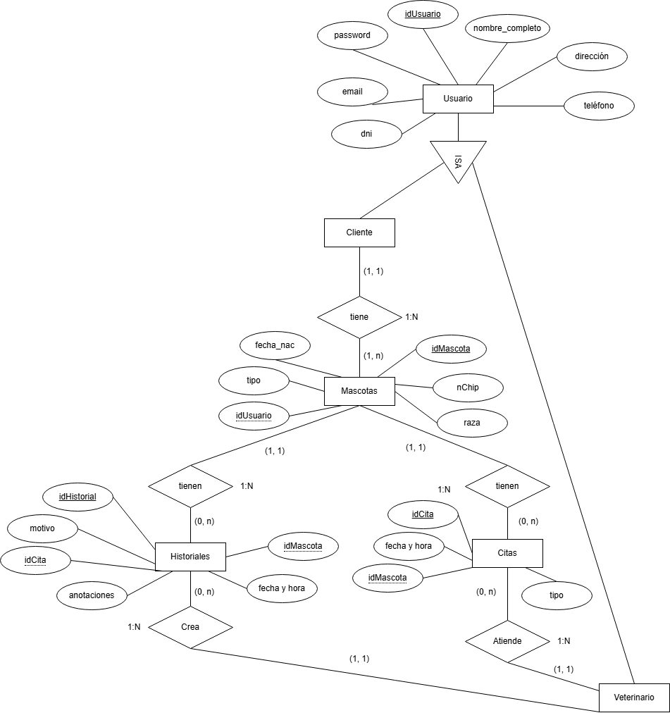
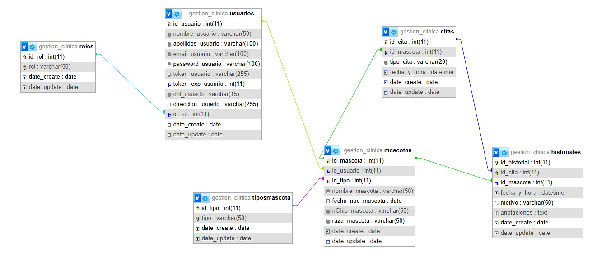

# FASE DE DESEÑO

- [FASE DE DESEÑO](#fase-de-deseño)
  - [1- Diagrama da arquitectura](#1--diagrama-da-arquitectura)
  - [2- Casos de uso](#2--casos-de-uso)
  - [3- Diagrama de Base de Datos](#3--diagrama-de-base-de-datos)
  - [4- Deseño de interface de usuarios](#4--deseño-de-interface-de-usuarios)

## 1- Diagrama da arquitectura

## 2- Casos de uso

## 3- Diagrama de Base de Datos

### Modelo entidad-relación

## Modelo relacional

## 4- Deseño de interface de usuarios

[Proyecto en Figma](https://www.figma.com/proto/uxAOJqyHggyEfxbHwytm41/Veterinaria?node-id=0-1&t=WKjNNUoZmPs43xJ0-1)
